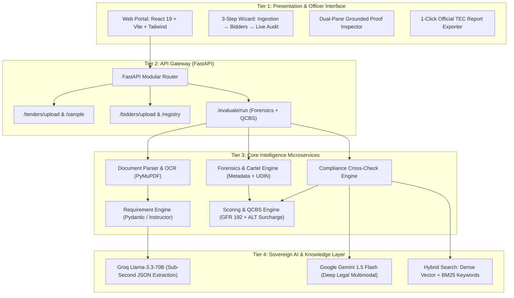

# SIH26100: Complete Slide-by-Slide Pitch Deck Content for SIH Hackathon
*(Focused on Ministry of Petroleum & Natural Gas with High-Resolution Visual System Design Diagrams)*

**Problem Statement ID:** SIH26100  
**Title:** AI-Powered Bid Compliance Verification & Anti-Cartelization Engine  
**Target Ministry:** Ministry of Petroleum and Natural Gas (MoPNG) | Extensible to MoRTH & GeM  
**Category:** Smart Governance, Anti-Corruption, Quality Critical Infrastructure  

---

> [!TIP]
> **To Your Teammate (Presentation Designer):**
> 1. **Classic Engineering Flowchart (Standard Logic Flowchart with Decision Diamonds & Process Blocks):**
>    Open [`docs/classic_flowchart_diagrams.html`](file:///c:/Users/swapn/Coding%20by%20rak/AI/bidder/docs/classic_flowchart_diagrams.html) in your browser & press **`Win + Shift + S`** to snip **Figure 1 (Logic Flowchart)** or **Figure 2 (Block Diagram)** directly into PPT Slide 5A/5B!
> 2. **Visual Network & Dark Presentation Diagrams:**
>    Available in [`docs/system_design_diagrams.html`](file:///c:/Users/swapn/Coding%20by%20rak/AI/bidder/docs/system_design_diagrams.html).

---

## 📽️ SLIDE 1: Title & Vision

### Header & Sub-header
* **Main Title:** AI-POWERED BID COMPLIANCE & PROCUREMENT INTELLIGENCE SYSTEM
* **Sub-title:** Eliminating the "L1 Quality Trap", Unmasking Bid Cartels, and Automating Technical Scrutiny under GFR 2017
* **Problem Statement:** SIH26100 — Ministry of Petroleum & Natural Gas (MoPNG)
* **Target PSUs:** GAIL, ONGC, IOCL, HPCL, BPCL
* **Presented by:** [Your Team Name / Team ID]

### Visual Layout Suggestion
* Official Ashoka Stambh emblem & MoPNG logo accent.
* Screenshot of the live system dashboard showing the **Green/Red compliance grid** and the **Cartel Alert Banner**.

### Speaker Notes (15 Seconds)
> *"Respected Jury, India's hydrocarbon infrastructure involves critical high-pressure pipelines, cryogenic storage, and refineries where a single sub-standard weld or fake certificate can lead to catastrophic national disasters. Yet, evaluation committees take months drowning in 100,000 pages of paperwork, while flawed bidding rules hand contracts to the cheapest bidders who cut quality. We present an Autonomous AI Scrutiny Engine that cuts evaluation time from 45 days to 15 seconds while ensuring zero corruption and maximum infrastructure durability."*

---

## 📽️ SLIDE 2: The Core Problem — The Procurement Trilemma

### Key Bullet Points
1. **The Overwhelming Volume Problem:**
   * A single MoPNG pipeline tender RFP is 300–800 pages. 50 competing EPC bidders submit 2,000 pages each (audited balance sheets, CA certificates, machinery deeds, ISO accreditations).
   * **Over 100,000 pages of scanned PDFs** per tender evaluated manually in Excel.
2. **The Fatigue & Human Error Window:**
   * Evaluation committees take **45 to 90 days**. Manual fatigue causes expired ISO 45001 safety certificates, forged balance sheets, and shell company bids to slip through.
3. **Cartelization & Bid Rigging:**
   * Competing bidders secretly collude from the same office, submit matching prices, or share Chartered Accountant UDIN numbers to game the minimum bidder rule.

### Visual Layout Suggestion
* A 3-column infographic:
  * 📄 Column 1: **100,000+ Scanned Pages** (Overwhelming Volume)
  * ⏳ Column 2: **45–90 Days Delay** (Manual Committee Fatigue)
  * 🕵️ Column 3: **Unnoticed Forgery & Cartels** (Zero Digital Forensics)

---

## 📽️ SLIDE 3: The "L1 Trap" — Why Critical Infrastructure Fails

### Key Bullet Points
1. **The Binary Gate Flaw:**
   * Current technical evaluation is a flat binary gate (`Pass` or `Fail`).
   * A contractor with a pristine 15-year pipeline safety record and one who barely scraped through 5 years of delayed projects get the exact same "Pass".
2. **The Lowest-Bidder (L1) Predatory Trap:**
   * Once qualified, contracts default to **L1 (Lowest Financial Quote)**.
   * Rogue contractors quote **35% below realistic engineering estimates** to win.
   * To survive, they dilute API-grade steel welding specs, use cheap sub-contractors, or delay execution with inflated variation claims.
3. **The Catastrophic Cost:** High-pressure pipeline leaks, refinery shutdowns, and stalled national energy corridors.

### Visual Layout Suggestion
* Graphic comparing:
  * **Naive L1 Bidding:** Cheap initial price $\rightarrow$ Substandard materials $\rightarrow$ 3x lifecycle maintenance cost & failure risk.
  * **Our Risk-Adjusted QCBS:** Quality-weighted score $\rightarrow$ Viable engineering price $\rightarrow$ Zero failure risk.

---

## 📽️ SLIDE 4: The Solution — Autonomous Procurement Intelligence

### Key Bullet Points
* **Autonomous Ingestion & Layout OCR:** Parses scanned and digital PDFs, tables, stamps, and raw PDF metadata using PyMuPDF and Docling.
* **Deterministic Clause Extraction:** Uses LLMs (Groq Llama-3.3-70B / Gemini) with strictly typed Pydantic schemas to extract mandatory gates and scoring metrics.
* **Forensic Anti-Cartelization Engine:** Audits underlying PDF creation metadata, timestamp proximity, and CA 18-digit UDIN cryptographic formats.
* **Risk-Adjusted QCBS Scoring:** Implements GFR Rule 192 (70:30 Quality & Cost Based Selection) with an automated **Abnormally Low Tender (ALT)** risk modifier.
* **100% Explainable Grounding:** Every check links directly to the exact clause and bidder page number with side-by-side evidence inspection.

### Visual Layout Suggestion
* Clean 4-step flowchart:
  `Tender Ingestion` $\rightarrow$ `Rule Extraction` $\rightarrow$ `Forensic Cross-Audit` $\rightarrow$ `QCBS Leaderboard`

---

## 📽️ SLIDE 5A: High-Level Design (HLD) & System Architecture

> [!NOTE]
> **Teammate Instruction:** Capture Diagram **`D1`** from [`docs/system_design_diagrams.html`](file:///c:/Users/swapn/Coding%20by%20rak/AI/bidder/docs/system_design_diagrams.html) for this slide!



### Key Architectural Highlights
1. **Asynchronous & Non-Blocking:** Decoupled architecture processes massive 5,000-page bidder packages without UI freezes.
2. **Deterministic Schemas:** LLMs never output freeform text; they are strictly bound by Pydantic type validators with automatic retry loops.
3. **Air-Gapped & Sovereign Ready:** Capable of running entirely on local offline LLMs (via Ollama / vLLM) on government servers without sending sensitive tender data outside India.

---

## 📽️ SLIDE 5B: Low-Level Design (LLD) & Data Engineering

> [!NOTE]
> **Teammate Instruction:** Capture Diagram **`D2`** from [`docs/system_design_diagrams.html`](file:///c:/Users/swapn/Coding%20by%20rak/AI/bidder/docs/system_design_diagrams.html) for this slide!

### 1. Modular Directory Breakdown
```
bidder/
├── backend/
│   ├── app/
│   │   ├── core/config.py            # API credentials & threshold settings
│   │   ├── models/                   # Strict Pydantic Data Contracts
│   │   │   ├── tender.py             # TenderRequirement, TenderBoQItem
│   │   │   ├── bidder.py             # BidderProfile, FinancialProfile, DocumentMetadata
│   │   │   ├── compliance.py         # ComplianceCheckItem, BidderComplianceReport
│   │   │   └── report.py             # QCBSLeaderboardEntry, CartelAlert, EvaluationReport
│   │   ├── services/
│   │   │   ├── document_parser.py    # PyMuPDF text, page chunking & metadata parser
│   │   │   ├── requirement_engine.py # LLM extraction with JSON schema validation
│   │   │   ├── compliance_engine.py  # Clause matching & proof snippet extraction
│   │   │   ├── forensics_engine.py   # Cartel detection, UDIN validation, timestamp analysis
│   │   │   └── scoring_engine.py     # GFR 2017 QCBS + ALT risk calculation
│   │   └── api/v1/                   # REST Endpoints: tenders, bidders, evaluate, reports
│   └── main.py                       # FastAPI application entrypoint
└── frontend/                         # React 19 + Vite Non-Tech-Savvy Web Application
```

### 2. Core Pydantic Schemas & Data Contracts
```python
class TenderRequirement(BaseModel):
    id: str                                  # e.g., "REQ-001"
    category: ClauseCategory                 # ELIGIBILITY | TECHNICAL | FINANCIAL | SAFETY
    clause_ref: str                          # e.g., "Section III (SCC) Clause 3.2"
    parameter: str                           # e.g., "Minimum Average Annual Turnover"
    threshold: str                           # e.g., ">= INR 15.0 Crore in each of last 3 FY"
    is_mandatory: bool                       # True = Hard Disqualification Gate
    qcbs_weight: float                       # Technical marks weightage (0 to 100)

class ComplianceCheckItem(BaseModel):
    requirement_id: str
    status: ComplianceStatus                 # COMPLIANT | NON_COMPLIANT | PARTIAL_DISCREPANCY
    claimed_value: str                       # Extracted bidder metric
    evidence_snippet: str                    # Exact grounded quote from PDF
    evidence_document: str                   # Filename containing proof
    evidence_page: int                       # Physical PDF page number
    confidence_score: float                  # 0.0 to 1.0 calibration
    rejection_reason: Optional[str]          # Legally grounded cause of rejection

class CartelAlert(BaseModel):
    alert_id: str
    signal_name: str                         # IDENTICAL_PDF_METADATA | DUPLICATE_CA_UDIN
    severity: str                            # CRITICAL | HIGH | MEDIUM
    bidders_involved: List[str]              # Colluding companies
    forensic_evidence: str                   # Detailed digital fingerprint match
    recommendation: str                      # CVC / Competition Commission referral
```

### 3. Forensic & Algorithmic Pipelines
* **Metadata Signature Extractor:** Parses binary PDF trailer dictionaries extracting `/Author`, `/Creator`, `/Producer`, `/CreationDate`, and calculates cryptographic SHA256 document hashes.
* **ICAI UDIN Regex Validator:** Validates the mandatory 18-digit Chartered Accountant Unique Document Identification Number: `^[0-9]{2}[0-9]{6}[A-Z0-9]{4}[A-Z0-9]{6}$`.
* **GFR 2017 QCBS Scoring Formula:**
  $$\text{Composite Score } S = (T_s \times W_t) + (F_s \times W_f)$$
  $$\text{Normalized Financial Score } F_s = \left(\frac{F_{min}}{F}\right) \times 100$$
* **Abnormally Low Tender (ALT) Risk Formula:**
  $$\text{If } F < 0.80 \times \text{Benchmark DPR Cost} \implies \text{ALT Triggered}$$
  $$\text{Adjusted Life-Cycle Cost} = F \times (1 + \text{Defect Failure Surcharge})$$

---

## 📽️ SLIDE 6: Our Four Winning Differentiators

| Innovation | What It Does | Why Existing Tools Fail |
| :--- | :--- | :--- |
| **1. Digital Forensics & Cartel Detection** | Flags when rival bidders share identical PDF creator metadata, same machine usernames, or duplicate CA UDINs. | Standard RAG only reads text; it completely ignores underlying digital PDF artifacts. |
| **2. MoPNG Infrastructure Safety Shield (ALT)** | Flags bids quoted $>20\%$ below engineering estimates and adds a 5-year **Life-Cycle Maintenance Risk Penalty**. | Naive procurement software blindly favors the cheapest bidder without viability checks. |
| **3. 100% Grounded Dual-PDF Audit Trail** | Clicking any status badge opens side-by-side proof: Tender Clause on left, highlighted Bidder excerpt on right. | Eliminates hallucinations. Bureaucrats will never trust a black-box AI without human sign-off. |
| **4. GCC vs. SCC Legal Hierarchy** | Automatically gives precedence to Special Conditions of Contract (SCC) over General Conditions (GCC). | Generic document tools get confused when conflicting clauses exist in the same tender. |

---

## 📽️ SLIDE 7: Live Demonstration Walkthrough

> [!NOTE]
> **Teammate Instruction:** Capture Diagram **`D3`** from [`docs/system_design_diagrams.html`](file:///c:/Users/swapn/Coding%20by%20rak/AI/bidder/docs/system_design_diagrams.html) for this slide!

### The Demonstration Scenario (Pre-Loaded in System)
* **Tender:** MoPNG 30 km High-Pressure Natural Gas Pipeline EPC (Budget: ₹32.70 Crore).
* **Requirements:** ₹15 Cr Turnover, 5 Yrs Experience, ISO 45001 Safety, Induction Bending Plant, ₹25 Lakhs EMD.

### The Three Competing Bidders:
1. **Bidder 1: Larsen & Toubro Hydrocarbon (LTHL)**
   * Average Turnover ₹24.5 Cr | 11.5 Yrs Exp | Valid ISO 45001 | Valid CA UDIN.
   * **Result:** 🟢 **Compliant on all gates (Tech Score: 100/100, Rank 1 Recommended Winner).**
2. **Bidder 2: Apex InfraTech Ltd**
   * Average Turnover ₹11.2 Cr (Deficit) | Expired ISO 45001 (Expired 2022).
   * **Result:** 🔴 **Disqualified with exact clause citations.**
3. **Bidder 3: Zenith Piping Corp (The Cartel / Predatory Bidder)**
   * Quoted ₹19.80 Cr (39.4% discount $\rightarrow$ Triggers **Abnormally Low Tender Risk**).
   * Exported from the exact same workstation (`Apex-Workstation-04`) and shared UDIN with Bidder 2!
   * **Result:** 🚨 **CRITICAL Cartel Collusion Alert triggered.**

---

## 📽️ SLIDE 8: Legal & Policy Compliance

### Built on Government of India Procurement Directives:
* **GFR 2017 Rule 192:** Quality & Cost Based Selection (QCBS) compliant formula ($T_s \times W_t + F_s \times W_f$).
* **CVC Circular 01/04/2021 (Abnormally Low Tenders):** Automated rate viability analysis against Schedule of Rates.
* **Competition Act 2002 (Section 3):** Automated detection of bid-rigging and horizontal price cartels.
* **ICAI Mandatory UDIN Norms:** Algorithmic verification of 18-digit Chartered Accountant identification numbers.
* **Ready for GeM & CPPP:** Modular REST APIs easily plug into the Government e-Marketplace (GeM) and Central Public Procurement Portal.

---

## 📽️ SLIDE 9: Officer Productivity, Time Multiplication & National Impact

### Efficiency & Bandwidth Multiplier (Empowering Class-1 Officers):
| Metric | Traditional Manual Committee Scrutiny | With Our AI Scrutiny Assistant | Productivity & Time Gain |
| :--- | :---: | :---: | :---: |
| **Committee Time Per Tender** | **200 Man-Hours** *(4 officers &times; 25 days)* | **8 to 12 Man-Hours** *(1 review session)* | **95% Reduction in Routine Paperwork** |
| **Tender Scrutiny Turnaround** | **45 to 60 Days** | **1 to 2 Days** *(Inclusive of human sign-off)* | **96% Faster Project Clearance** |
| **Committee Processing Capacity** | 2 to 3 tenders / month | **20+ tenders / month per committee** | **8x to 10x Operational Throughput** |
| **Detection of Cartels & Forged UDINs**| Humanly impossible across 60k pages | **100% Automated Metadata & UDIN Audit** | **Full CVC Vigilance Compliance** |
| **AI Operating Cost Per Tender** | N/A | **₹340** *(NIC MeghRaj Cloud compute)* | **Negligible cost per infrastructure tender** |
| **Avoided Project Delay Losses** | ₹1.2 to ₹3.5 Cr *(45-day delay on ₹300Cr pipeline)* | **₹0 Delay** *(Immediate clearance)* | **Direct National Economic Savings** |

### Key Takeaway for Judges:
* *"We do not eliminate officers—we eliminate the 190 hours of manual clerical cross-checking per tender, empowering Class-1 Officers to focus 100% on strategic engineering scrutiny, site inspection, and final statutory sign-off."*

---

## 📽️ SLIDE 10: Future Scope & Horizontal Scalability

### 1. Horizontal Domain Scalability: Ministry of Road Transport & Highways (MoRTH / NHAI)
* **Domain-Agnostic Modular Engine:** The core scoring and forensics pipeline easily adapts to highway procurement by loading a **MoRTH Civil EPC Rule Matrix**:
  * **Bitumen Rate Scrutiny:** Compares quoted VG-40 bitumen rates against wholesale refinery indices to eliminate contractor underbidding (the primary cause of premature highway potholes).
  * **IRC:37 Pavement Standards:** Verifies subgrade CBR and electronic sensor paver ownership.
  * **5-Year Defect Liability Period (DLP):** Automates bank guarantee and performance security tracking for long-term road maintenance.

### 2. Live Statutory API Lookups (Q1 Post-Hackathon)
* Automated live verification against **MCA21** (Ministry of Corporate Affairs) for shell company detection and **GSTN** for active tax compliance.

### 3. GeM 3.0 & CPPP Direct Pipeline Integration (Q2)
* Direct plugin into the Government e-Marketplace as a first-line AI Scrutiny Bot before human committee review.

### 4. Blockchain Immutable Audit Trail
* Cryptographic hashing of evaluation results on Hyperledger Fabric, preventing post-opening record tampering.

---

## 📽️ SLIDE 11: Anticipating Jury Questions & Defense

### Q1: "Can an LLM hallucinate and qualify a fraudulent bidder?"
* **Our Defense:** *"No. The LLM never makes the final legal decision. It acts as an AI Scrutiny Assistant that extracts and grounds evidence. Every single claim is linked to a physical page number and quote. If the evidence isn't physically in the document, it is marked Non-Compliant. The committee retains final sign-off with 1-click verification."*

### Q2: "How do you handle bad quality mobile scans or Hindi language certificates?"
* **Our Defense:** *"Our pipeline uses a two-tier OCR system: PyMuPDF/Docling for native PDFs, and Surya OCR with contrast normalization and regional Hindi character models for low-DPI scans."*

### Q3: "Why not just use L1 as the government always has?"
* **Our Defense:** *"Because pure L1 forces bidders into a race-to-the-bottom where they cut welding, safety, and material standards just to survive. Our system equips MoPNG with Risk-Adjusted QCBS and ALT alerts, enforcing uncompromising engineering quality while strictly following GFR 2017."*
